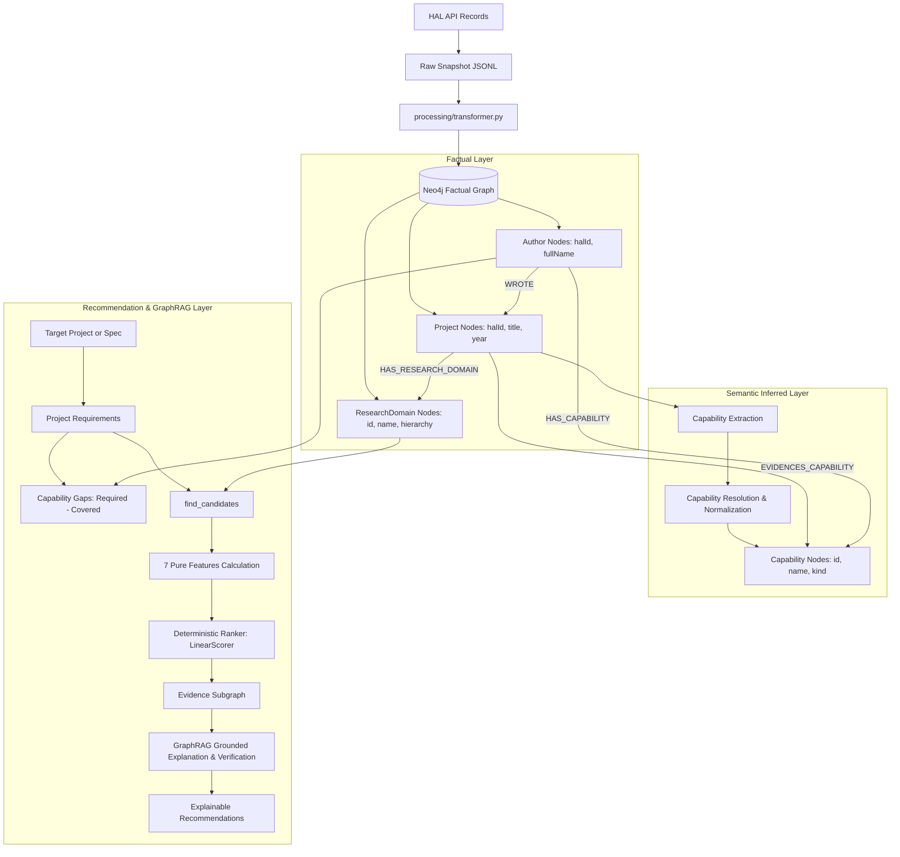

# Data Flow Architecture

This document describes the complete end-to-end data flow of the Hybrid Collaborator Recommendation System, from raw HAL API ingestion through graph transformation, semantic extraction, and recommendation generation.

---

## 1. End-to-End Flow Diagram



---

## 2. Layer Responsibilities & Contracts

| Layer | Source of Truth | Mutability | Entities & Properties |
|---|---|---|---|
| **Factual Graph** | HAL Ingestion | Read-only | `Project`, `Author`, `ResearchDomain`, `Conference`, `Organization`, `WROTE`, `HAS_RESEARCH_DOMAIN` |
| **Semantic Inferred Layer** | Capability extraction & aggregation | Versioned (`v1`, `v2`) | `Capability`, `EVIDENCES_CAPABILITY` (`inferred: true`, `confidence`, `evidenceText`), `HAS_CAPABILITY` (`score`, `publicationCount`) |
| **Requirements Layer** | Cache JSON (`data/requirements/`) | On-demand | `ProjectRequirements`, `RequiredCapability`, `CapabilityGap` |
| **Recommendation Layer** | GraphAdapter (`src/graph/`) | Pure / In-memory | `CandidateRef`, `ScoredCandidate`, `EvidenceItem`, `ExplanationContext` |

---

## 3. Facts vs. Inferences Auditing Rule

- **Facts:** All properties directly fetched from HAL (titles, abstracts, authors, publication years, domain taxonomy).
- **Inferences:** Any capability or requirement generated by models. Must always be marked with `inferred: true`, `extractionVersion`, `model`, and evidence provenance. Older versions are preserved when new extraction versions run.


## HAL source to factual Neo4j graph

1. [`HalClient`](../src/connectors/hal_client.py) queries the UTC HAL endpoint
   with `*:*` by default and requests the fields in `HalClient.fields`.
   Pagination uses `start`/`rows`; a sort can be supplied for stable
   offset-based paging.
2. [`create_hal_snapshot`](../src/connectors/hal_snapshot.py) writes the raw
   records to JSONL and a manifest containing the query, requested fields,
   HAL `numFound`, fetched count, timestamp, sort, and page size. Author
   parallel fields are padded in the snapshot representation to make their
   array lengths comparable; the original in-memory response is not changed.
3. [`validate_hal_documents`](../src/validation/hal_validator.py) checks
   records before a full import. Missing optional metadata, suspicious source
   values, and parallel-array length differences are reported as warnings.
   Duplicate HAL identifiers and other structural errors block full import.
4. [`processing/transformer.py`](../src/processing/transformer.py) maps HAL
   records to the canonical Project, Author, Conference, Organization, and
   ResearchDomain models. The D2 author-identity correction only realigns
   uniquely name-matched cross-position IDs when a shift is confirmed; it
   then uses `person_<authIdPerson_i>` and `unknown_<name>` fallbacks.
5. [`Neo4jManager`](../src/database/neo4j_manager.py) writes factual nodes and
   relationships. It uses `MERGE` keyed by existing schema identifiers and
   `ON CREATE SET` for node properties. Re-ingestion therefore avoids
   recreating the same keyed nodes/relationships, but does not refresh
   existing node properties or remove stale nodes/relationships.

The full-import CLI requires `--full-import`, an explicit acknowledgement
that the D2 migration/rebuild plan was reviewed, and a database. The database
can be provided as `--database` or `NEO4J_DATABASE` in the local `.env`.
Credentials must remain local and must not be committed or copied into
reports. The `.gitignore` excludes `exports/` and `reports/`, so snapshots
and generated reports are local-only, not shared by GitHub. Each contributor
must create or obtain an authorized snapshot locally; the committed
data-quality summary is in [`data_quality.md`](data_quality.md).

```powershell
$env:PYTHONPATH = "$PWD\src"
& .\.venv\Scripts\python.exe src\pipeline.py `
  --full-import `
  --identity-migration-reviewed
```

Use this only after confirming that `.env` points to the intended target,
that the full-snapshot review is approved, and that the D2 identity migration
plan is appropriate for that graph. To use an existing complete snapshot,
add `--snapshot <records.jsonl>`.

The bounded development import instead requires a snapshot, limit, and
explicit isolated development database:

```powershell
$env:PYTHONPATH = "$PWD\src"
& .\.venv\Scripts\python.exe src\pipeline.py `
  --snapshot exports\hal_snapshot\<snapshot-directory>\records.jsonl `
  --limit 1000 `
  --database <isolated-dev-database>
```

The bounded path caps imports at 2,000 records. Do not run it against a
shared/production database merely because that database name is available.

## Graph read boundary

The graph schema is centralized in [`config/graph_mapping.yaml`](../config/graph_mapping.yaml).
Recommendation and capability code should depend on the stable
[`GraphAdapter`](../src/graph/adapter.py) contract, not on physical labels,
properties, relationship names, or Cypher.

The fact methods implemented by [`Neo4jAdapter`](../src/graph/neo4j_adapter.py)
are:

- `get_project`: reads Project properties.
- `iter_projects`: returns an identifier-ordered, bounded page.
- `get_project_members`: follows `(Author)-[:WROTE]->(Project)`.
- `get_project_domains`: reads assigned ResearchDomains and their
  `SUBDOMAIN_OF` ancestors.

The adapter marks `unknown_` author IDs as placeholders. Its requirements,
capability, candidate, evidence, and co-author-distance methods are
Stage B/C work and currently raise `NotImplementedError`.

`FakeAdapter` and `tests/fixtures/dev_projects.json` are deterministic,
synthetic contract fixtures. They are not HAL records and are not evidence
that a live database contains those records.

## Facts and inferred data

HAL fields and the existing graph entities/relationships are factual data.
Capabilities and project requirements are derived in later stages and must
remain distinguishable from those facts, with their required provenance and
version metadata. ResearchDomain is the authoritative HAL taxonomy; Stage B
must not rewrite it or treat it as a Capability.
