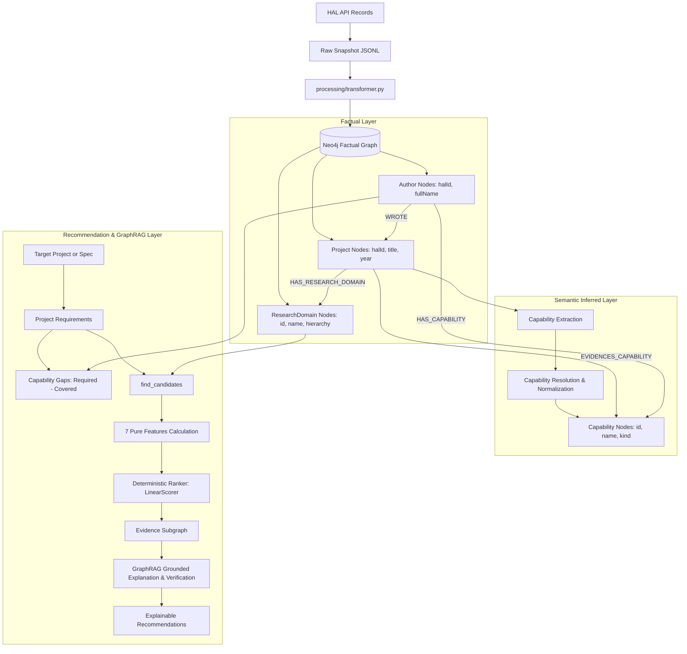

# Data Flow Architecture

This document describes the complete end-to-end data flow of the Hybrid Collaborator Recommendation System, from raw HAL API ingestion through graph transformation, semantic extraction, and recommendation generation.

---

## 1. End-to-End Flow Diagram

---

## 2. Layer Responsibilities & Contracts

| Layer | Source of Truth | Mutability | Entities & Properties |
|---|---|---|---|
| **Factual Graph** | HAL Ingestion | Read-only | `Project`, `Author`, `ResearchDomain`, `Conference`, `Organization`, `WROTE`, `HAS_RESEARCH_DOMAIN` |
| **Semantic Inferred Layer** | Capability extraction & aggregation | Versioned (`v1`, `v2`) | `Capability`, `EVIDENCES_CAPABILITY` (`inferred: true`, `confidence`, `evidenceText`), `HAS_CAPABILITY` (`score`, `publicationCount`) |
| **Requirements Layer** | Cache JSON (`data/requirements/`) | On-demand | `ProjectRequirements`, `RequiredCapability`, `CapabilityGap` |
| **Recommendation Layer** | GraphAdapter (`src/graph/`) | Pure / In-memory | `CandidateRef`, `ScoredCandidate`, `EvidenceItem`, `ExplanationContext` |

---

## 3. Facts vs. Inferences Auditing Rule

- **Facts:** All properties directly fetched from HAL (titles, abstracts, authors, publication years, domain taxonomy).
- **Inferences:** Any capability or requirement generated by models. Must always be marked with `inferred: true`, `extractionVersion`, `model`, and evidence provenance. Older versions are preserved when new extraction versions run.
